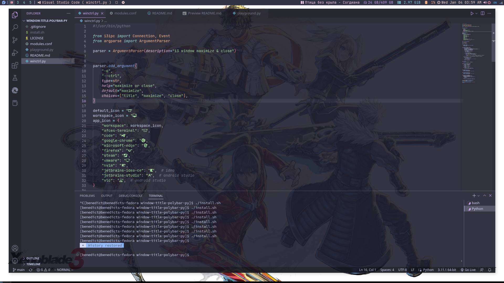

# window-title-polybar

Window Title mechanism in Python for Polybar



## Quick Start

1. copy winctrl.py to ~/.local/bin/

2. copy [modules](modules.conf) to your polcy bar config

   ```bash
   [module/window-title]
   type = custom/script
   exec = ~/.local/bin/winctrl.py -c title
   format-foreground = ${colors.flamingo}
   format-background = ${colors.background}
   format-padding = 1
   ; important! this is required to only show the last printed line in the bar
   tail = true

   [module/maximize]
   type = custom/script
   exec = ~/.local/bin/winctrl.py -c maximize
   format-foreground = ${colors.flamingo}
   format-background = ${colors.background}
   format-padding = 1
   click-left = i3-msg fullscreen toggle &
   tail = true

   [module/closewindow]
   type = custom/script
   exec = ~/.local/bin/winctrl.py -c close
   format-foreground = ${colors.flamingo}
   format-background = ${colors.background}
   format-padding = 1
   click-left = i3-msg kill &
   tail = true

   ```

3. update the polcybar conf to include the modules:

```bash
modules-left = [your existing modules] window-title maximize closewindow
```

## Plans

1. Move Mappings to ~/.config/winctrl/config.yaml - Done
2. Fix the bug that when no active window, the title will print 3 times - Done
3. Adjust the code structure - check terminal app and non-terminal app separately - Done
4. Extract app `extract_app_from_information` should also be configurable

## Refence Links

[i3ipc-python](https://github.com/altdesktop/i3ipc-python)

[argparse](https://docs.python.org/3/howto/argparse.html)

[polybar custom modules](https://github.com/polybar/polybar/wiki/Module:-script)
